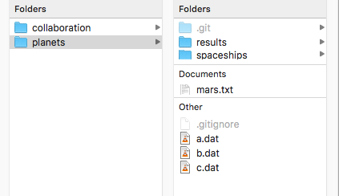
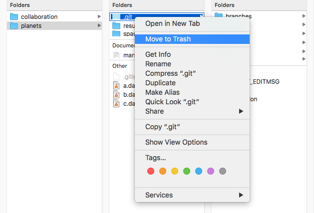

# Git Reference

[Routine workflow: Push changes to a remote repository: quick steps](#Push-changes-to-a-remote-repository-quick-steps)

[Project setup: Initialize a local repository on your computer](#Initialize-a-local-repository-on-your-computer)

[Project setup: Set up a remote repository on GitHub](#Set-up-a-remote-repository-on-github)

[Ignoring and removing files from your repository](#Ignoring-and-removing-files-from-your-repository)

[Delete a local git repository on your computer](#Delete-a-local-git-repository-on-your-computer)

(#Push-changes-to-a-remote-repository-quick-steps)=
## Push changes to a remote repository: quick steps

If you have already [initialized a local repository on your computer](#initialize-a-local-repository-on-your-computer) and [set up a remote repository on GitHub](#set-up-a-remote-repository-on-github), running the three commands below in your local project directory will add all new files and changes and push them to GitHub.

```
git add .
git commit -m "Write a descriptive commit message here."
git push origin master
```

Note that `git add .` adds all files in the working directory and subdirectory to the repository. You can also add specific files.

```
git add file1.txt file2.txt file3.txt
```

__Replace the commit message between the quotes with a brief description of the changes that you have made.__

(#Initialize-a-local-repository-on-your-computer)=
## Initialize a local repository on your computer

Run the following command in your local project directory:

```
git init
```

You only have to do this once for each project. You do not have to run this command in sub-directories.

(#Set-up-a-remote-repository-on-github)=
## Set up a remote repository on GitHub

Go to your GitHub account page

Click the green "New" button

Enter a name for the repository and select whether the repository will be public or private

In the project directory on your local computer, run the following command:
```
git remote add origin https://github.com/user-name/repository-name.git
```

__Replace the address above with the address of the remote repository you created on GitHub.__

If you have not done so already, [initialize a local repository on your computer](#initialize-a-local-repository-on-your-computer)

Follow the quick steps to [push changes to a remote repository](#push-changes-to-a-remote-repository-quick-steps)

You only have to do this once for each project.

(#Ignoring-and-removing-files-from-your-repository)=
## Ignoring and removing files from your repository

__Ignoring files__

Create a text file called `.gitignore` and place it in the main directory of your project. The contents of the file should contain a list of files (or file patterns) that are on your computer, but do not want to share with others (e.g. `.DS_Store`,`Thumbs.db`,`*.pyc`).

For more information: https://www.atlassian.com/git/tutorials/gitignore

__Removing files from your repository without removing them from your computer__

```
git rm --cached file1.txt file2.txt file3.txt
```

(#Delete-a-local-git-repository-on-your-computer)=
## Delete a local git repository on your computer

Sometimes you may want to delete a local git repository that you have already created with `git init`. You want to keep the files, but undo everything that has been done with git. This situation might arise if you make a mistake, like initializing in the wrong directory. Deleting the repository allows you to start over.

There is no special command for deleting a local repository. Instead, you need to delete the hidden `.git` directory that was created when you ran `git init`. This is where git stores all files related to your project.

Deleting the `.git` directory can be done on the command line. However, the instructions here demonstrate how to do this in the file browser because there is less chance of making a catastrophic error. The directions depend on the operating system (scroll down for Windows).

### Mac

In the Finder, navigate to your main project directory (the one where you ran `git init`).


To show the hidden files, type <kbd>command</kbd> + <kbd>Shift</kbd> + <kbd>.</kbd>



Delete the `.git` directory.



Your local git repository has been deleted. You can now start over and [initialize a new repository](#initialize-a-local-repository-on-your-computer)

### Windows

* Open File Explorer from the taskbar. Navigate to your main project directory (the one where you ran `git init`).

* Select *View > Options > Change folder* and search options.

* Select the View tab and, in *Advanced settings*, select *Show hidden files, folders, and drives* and *OK*.

* Delete the `.git` directory. Your local git repository has been deleted. You can now start over and [initialize a new repository](#initialize-a-local-repository-on-your-computer)

Source for instructions on viewing hidden files and folders: [Microsoft support](https://support.microsoft.com/en-us/windows/view-hidden-files-and-folders-in-windows-10-97fbc472-c603-9d90-91d0-1166d1d9f4b5)

